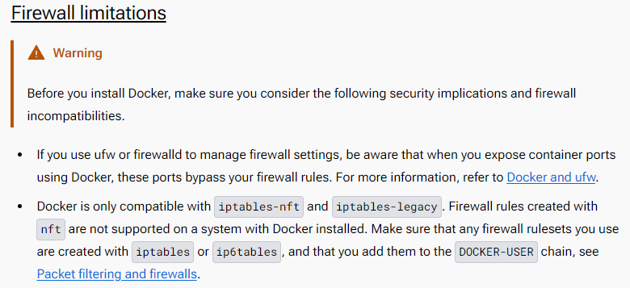

# Ollo Infra Task

## 1. dockerインストール
やること：サーバにdockerをインストールする。  
  
とりあえず公式ドキュメントの通り実行する。  
[→リンク](https://docs.docker.com/engine/install/ubuntu/)  
  

- - -
### タスク
#### 1. 前提(設定する環境)
　  
  OS:Ubuntu Focal 20.04  
  docker:27.1.1  
　  
　  
#### 2. dockerインストールの前に  
　  
公式ページの一番上にこんな注意書きが…  
  
　  
　  
dockerはufwやfirewalldの設定の影響を受けるとのこと。  
この環境はubuntuなのでufwがプレインストールされているはず、念のためufwの状態を確認しておく。　　

~~~shell:shell
sudo systemctl status ufw         # ufwのサービスが生きているか
~~~
~~~shell:shell
sudo ufw status                   # ufwが有効か
~~~

どうやら、ufwは入っているがアクティブではない模様。  
クラウドはSGでポート制御をする想定なのでufwやfirewalldは基本的に止まっていた気がする。  
つまり気にしなくてヨシ。  
　  
　  
#### 3. dockerインストール  
　  
まず、dockerがプリインストールされていないか確認する。  

~~~shell:shell
docker
~~~

「Command 'docker' not found」なら未インストールなのでこのままインストールを続ける。  
　  
パッケージ管理がしやすい気がするので[aptでインストール](https://docs.docker.com/engine/install/ubuntu/#install-using-the-repository)する。  
- 公式のGPGキーを入手する
~~~shell:shell
sudo apt-get update
sudo apt-get install ca-certificates curl
sudo install -m 0755 -d /etc/apt/keyrings
sudo curl -fsSL https://download.docker.com/linux/ubuntu/gpg -o /etc/apt/keyrings/docker.asc
sudo chmod a+r /etc/apt/keyrings/docker.asc
~~~
- レポジトリを追加
~~~shell:shell
echo \
  "deb [arch=$(dpkg --print-architecture) signed-by=/etc/apt/keyrings/docker.asc] https://download.docker.com/linux/ubuntu \
  $(. /etc/os-release && echo "$VERSION_CODENAME") stable" | \
  sudo tee /etc/apt/sources.list.d/docker.list > /dev/null

sudo apt-get update
~~~
結果、最後のapt-getで最初のapt-getに無かった"download.docker.com"のレポジトリが追加される。  
　  
　  
☆最新版ではなくバージョン指定なので、"Specific version"の手順で  
- インストールするバージョンのパッケージ名を調べる
~~~shell:shell
apt-cache madison docker-ce | awk '{ print $3 }' | grep 27.1.1  # 対象のバージョンでgrep
~~~
- インストールするバージョンのパッケージ名を変数に入れる
~~~shell:shell
VERSION_STRING=5:27.1.1-1~ubuntu.20.04~focal
~~~
- dockerパッケージをインストールする  
~~~shell:shell
sudo apt-get install docker-ce=$VERSION_STRING docker-ce-cli=$VERSION_STRING containerd.io docker-buildx-plugin docker-compose-plugin
~~~
☆"Do you want to continue? [Y/n]"と聞かれたら、"Y"で続行  
　  
　  
これでdockerがインストールできたので、バージョンを確認してみる。  
~~~shell:shell
docker --version
~~~
"Docker version 27.1.1"と帰ってきたら成功！
